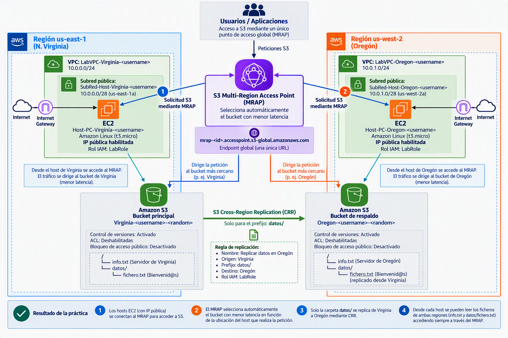

# Práctica

La duración estimada de esta práctica es de 2h.

Vamos a implementar la siguiente arquitectura usando CRR y MRAP:



Una cosa a tener en cuenta: cuando pongamos `$username` en el nombre sustituimos por la primera letra de nuestro nombre (si tenemos varios nombres, sólo usaremos la primera letra del primer nombre), primera letra del apellido y segundo apellido completo (si no tienes segundo apellido, pon el primer apellido completo). Por ejemplo, en mi caso que soy Rafael González Centeno `$username = rgcenteno`Esto permitirá ver la autoría de las prácticas

## Creación de VPC y sub-redes públicas host de acceso

### Virginia

1. Crea una VPC llamada `LabVPC-Virginia-$username` que se encuentre en la region **us-east-1**  trabaje en un bloque CIDR 10.0.0.0/24
2. Cree una subred pública llamada `SubRed-Host-Virginia-$username` en la zona de disponibilidad us-east-a1 CIDR 10.0.0.0/28
3. Crea una Puerta de enlace de internet, llámala `ig-Virginia-$username` y asignala a la VPC LabVPC-Virginia.
4. Crea una tabla de enrutamiento llamada `tr-pública-Virginia-$username` y asignala la VPC. Añade una ruta con Destino: 0.0.0.0/0 que salga por la puerta de enlace de Internet recién creada.
5. Asigna la tabla de enrutamiento a la SubRed-Host-Virginia-$username.
6. Cree una instancia EC2 en la Región us-east-1:
   - Nombre: `Host-PC-Virginia-$username`
   - AMI: Amazon Linux más actual que sea Apta para la capa gratuita
   - Instancia t3.micro
   - Utiliza el par de claves vockey
   - Establece la máquina EC2 en la subred `SubRed-Host-Virginia-$username` con IP pública.
   - Asignación automática de IP pública: Habilitar
   - Crea una regla de seguridad llamada Permitir SSH abriendo el puerto 22 a cualquier origen
   - Resto de campos por defecto
   - Rol de IAM: LabRole

> LabRole es una política de identidad que ya tiene permisos sobre S3. Lo recomendable es usar políticas de identidad cuando sean accesos desde la misma cuenta y políticas de recursos si necesitamos habilitar un permiso para un rol o usuario externo. 
>
> Con esta política hacemos una gestión de permisos alineada con los principios de **least privilege (mínimo privilegio)** y **centralized access management (gestión centralizada de accesos)** de AWS IAM que recomienda seguir la siguiente pauta:
>
> Priorizar el uso de IAM Roles para la concesión de permisos y recurrir a Resource-based Policies únicamente cuando sea necesario compartir recursos entre cuentas o gestionar permisos directamente sobre el recurso."

### Oregón

1. Crea una VPC llamada `LabVPC-Oregon-$username` que se encuentre en la region **us-west-2**  trabaje en un bloque CIDR 10.0.1.0/24

2. Cree una subred pública llamada `SubRed-Host-Oregon-$username` en la zona de disponibilidad us-west-2a CIDR 10.0.1.0/28

3. Crea una Puerta de enlace de internet, llámala `ig-Oregon-$username` y asignala a la VPC LabVPC-Oregon

4. Crea una tabla de enrutamiento llamada `tr-pública-Oregón-$username` y asignala la VPC. Añade una ruta con Destino: 0.0.0.0/0 que salga por la puerta de enlace de Internet recién creada

5. Asigna la tabla de enrutamiento a la `SubRed-Host-Oregon-$username`

6. Cree una instancia EC2 en la Región us-west-2a:

   - Nombre: `Host-PC-Oregón-$username`

   - AMI: Amazon Linux más actual que sea Apta para la capa gratuita

   - Instancia t3.micro

   - Crea un nuevo par de claves llamadas OregonKeys RSA y pem. **Guarda el fichero pem descargado!!**

   - Establece la máquina EC2 en la subred `SubRed-Host-Oregon-$username` con IP pública

   - Asignación automática de IP pública: Habilitar

   - Crea una regla de seguridad llamada Permitir SSH abriendo el puerto 22 a cualquier origen

   - Rol de IAM: LabRole

   - Resto de campos por defecto

## Creación de bucket Principal (Virginia)

Crear bucket main
Creamos un bucket en Virginia llamado `Virginia-$username-$cadena_random`

- ACL deshabilitadas
- Marcamos el checkbox "**Bloquear *todo* el acceso público**" (se conseguirá el acceso mediante roles o políticas)
- Habilitamos control de versiones del bucket
- resto por defecto
- Subimos un fichero info.txt al bucket con el contenido: "Servidor de Virginia"
- Crear una carpeta datos en la raíz del bucket

## Crear bucket de respaldo (Oregón)

Creamos un bucket en Oregon llamado `Oregon-$username-$cadena_random`

- ACL deshabilitadas
- Marcamos el checkbox "**Bloquear *todo* el acceso público**" (se conseguirá el acceso mediante roles o políticas)
- Habilitamos control de versiones del bucket
- resto por defecto
- Subimos un fichero info.txt al bucket con el contenido: "Servidor de Oregón"
- Crear una carpeta datos en la raíz del bucket

## Habilitar replicación

Habilitamos replicación en Norte Virginia sobre Oregon **solo para la carpeta datos**
Crear regla de replicación

- Nombre: Replicar datos en Oregón

- Origen: Virginia

- Prefijo: datos/ (Esto hace que sólo se aplique para la carpeta datos/)

- Destino: Oregon

- Se debería crear un rol pero no nos deja (es una limitación de los labs). Asociamos el rol `LabRole`. A nivel informativo, el Rol que deberíamos crear para permitir la replicación podría llamarse `Replicar-s3-virginia-oregon` y sería algo similar a esto:

**Entidad de confianza**: EC2

**Pólitica:**

```json
{
 "Version": "2012-10-17",
 "Statement": [
 {
 "Sid": "ReadSourceBucketConfiguration",
 "Effect": "Allow",
 "Action": [
 "s3:GetReplicationConfiguration",
 "s3:ListBucket"
 ],
 "Resource": "arn:aws:s3:::virginia-rgcenteno"
 },
 {
 "Sid": "ReadSourceObjects",
 "Effect": "Allow",
 "Action": [
 "s3:GetObjectVersion",
 "s3:GetObjectVersionAcl",
 "s3:GetObjectVersionTagging"
 ],
 "Resource": "arn:aws:s3:::virginia-rgcenteno/*"
 },
 {
 "Sid": "ReplicateToDestinationBucket",
 "Effect": "Allow",
 "Action": [
 "s3:ReplicateObject",
 "s3:ReplicateDelete",
 "s3:ReplicateTags",
 "s3:ObjectOwnerOverrideToBucketOwner"
 ],
 "Resource": "arn:aws:s3:::oregon-rgcenteno/*"
 }
 ]
}
```

- Ahora subimos al s3 de virginia dentro de la carpeta `datos` un fichero llamado `fichero.txt` con el texto "Bienvenid@s".

- Comprobar que se replica en el destino para ello tenemos dos maneras:

  - Ir al bucket de Oregón y ver que aparece el elemento
  - Abrir el objeto (fichero) creado en Virginia y en la pestaña de Administración comprobar que el Estado de replicación es `COMPLETED`

## Comprobando acceso desde hosts

### Host de Virginia

Para conectarnos a este host podemos usar el tutorial estándar de conexión a instancias EC2. Lo puedes localizar en la página donde arrancas el lab pulsando en el enlace "*Acceso a instancias de ec2*"

Una vez conectados ejecutamos los siguientes comandos para comprobar que tenemos acceso a los ficheros. Sustituye `s3://virginia-s3-rgcenteno`por el nombre de tu bucket en Virginia.

```sh
[ec2-user@ip-10-0-0-4 ~]$ aws s3 cp s3://virginia-s3-rgcenteno/info.txt -
Servidor de Virginia

[ec2-user@ip-10-0-0-4 ~]$ aws s3 cp s3://virginia-s3-rgcenteno/datos/fichero.txt -
Bienvenid@s
```

Comprobamos también que podemos obtener los ficheros de Oregón:

```bash
[ec2-user@ip-10-0-0-4 ~]$ aws s3 cp s3://oregon-s3-rgcenteno/info.txt -
Servidor de Oregón
[ec2-user@ip-10-0-0-4 ~]$ aws s3 cp s3://oregon-s3-rgcenteno/datos/fichero.txt -
Bienvenid@s
```

No cierres la consola, la usaremos más adelante.

### Host de Oregón

Para conectarnos al host de Oregón tenemos que hacer los mismos pasos que en el caso anterior pero usando el fichero pem descargado cuando lo generamos (`OregonKeys.pem`). Hacemos los mismos pasos que con Virginia para comprobar que todo funciona correctamente.

Ahora mismo tenemos un bucket en Virginia que se replica en otro bucket que se encuentra en la región de Oregón. Tenemos una máquina en Virginia y otra en Oregón que se pueden conectar a los buckets y leer la información.

Tampoco cierres esta consola, la usaremos más adelante.

## Crear el punto de acceso multi-región

Vamos a crear un [punto de acceso multi-región (MRAP)](https://docs.aws.amazon.com/AmazonS3/latest/userguide/MultiRegionAccessPoints.html). Esta es una herramienta muy útil que nos puede ayudar a reducir la latencia de acceso a datos S3 seleccionando para cada petición el bucket con menor tiempo de acceso. También permite configuraciones activo-pasivo que nos permiten aumentar la disponibilidad.

Pasos:

1. En Servicios vamos a S3

2. Menú lateral izquierdo Seguridad y administración de acceso > Puntos de acceso

3. Pestaña Mutirregional

4. Pulsamos Crear un punto de acceso para varias regiones

   - Nombre: `mrap-virginia-oregon-$username`
   - Agregar buckets de esta cuenta y seleccionamos ambos
   - *Desmarcamos Bloquear todo el acceso público*
   - Pulsamos el botón Crear un punto de acceso para varias regiones

Una vez hechos estos pasos esperamos varios minutos a que el MRAP esté activo. Una vez esté activo pinchamos sobre el MRAP y copiamos el arn del mismo.

## Testear el funcionamiento

Ahora podemos acceder a los recursos en el bucket poniendo el nombre del MRAP en vez de accediendo al bucket individualmente. El MRAP, dependiendo de la ubicación de la petición usará el bucket con una latencia menor. Esto es muy útil si en la empresa tenemos varias ubicaciones diferentes y queremos reducir la latencia de acceso para cada una de nuestras ubicaciones.

Vamos a testear el comportamiento.

### Host de Virginia

Desde la consola del host de Virginia ejecutamos el siguiente comando (recuerda cambiar el arn de mi rmap por el tuyo) para recuperar un fichero de documentación:

```bash
[ec2-user@ip-10-0-0-4 ~]$ aws s3 cp s3://arn:aws:s3::267605637056:accesspoint/mth3h9rq7he1k.mrap/datos/fichero.txt -
Bienvenid@s
```

Vemos que nos devuelve el contenido del fichero. En realidad no sabemos cuál ya que el MRAP se encarga de enviar la petición al S3 con menor latencia. Si ejecutamos el siguiente comando:

```bash
[ec2-user@ip-10-0-0-4 ~]$ aws s3 cp s3://arn:aws:s3::267605637056:accesspoint/mth3h9rq7he1k.mrap/info.txt -
Servidor de Virginia
```

Vemos que al servidor de Virginia le está contestando el Servidor S3 ubicado en Virginia.

### Host de Oregón

Ahora vamos a hacer las mismas pruebas con la consola del Host de Oregón (recuerda cambiar el arn del MRAP):

```bash
[ec2-user@ip-10-0-1-4 ~]$ aws s3 cp s3://arn:aws:s3::267605637056:accesspoint/mth3h9rq7he1k.mrap/datos/fichero.txt -
Bienvenid@s
```

Si solicitamos el fichero info.txt

```bash
[ec2-user@ip-10-0-1-4 ~]$ aws s3 cp s3://arn:aws:s3::267605637056:accesspoint/mth3h9rq7he1k.mrap/info.txt -
Servidor de Oregón
```

Obtenemos el servidor de Oregón que es el que está más cerca del dispositivo y por lo tanto el que menor latencia tiene.
